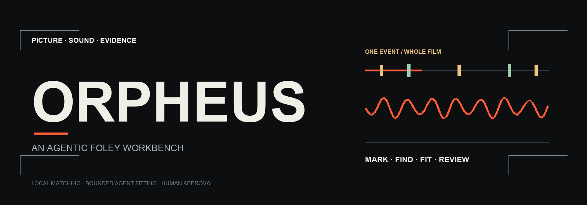
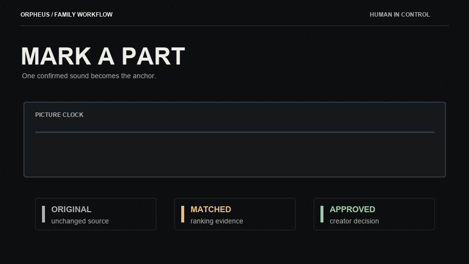
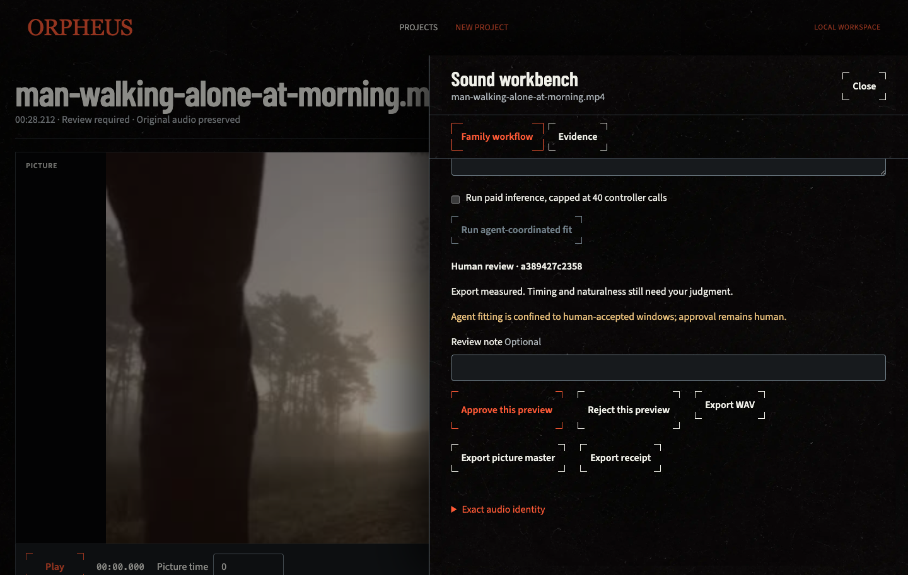
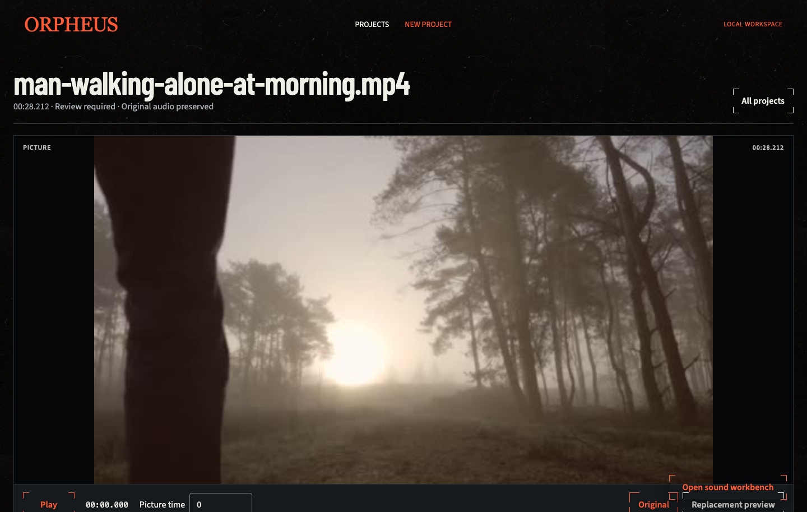
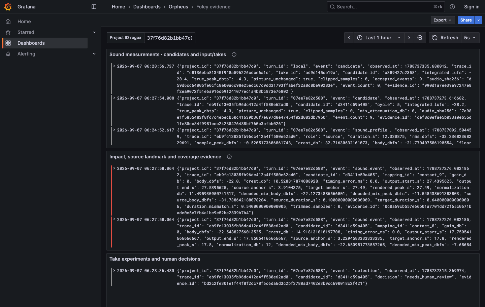
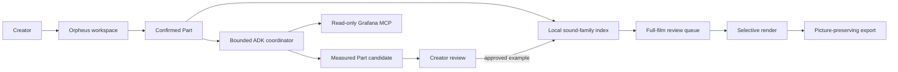

<p align="center">
  
</p>

<div align="center">
  <h1>Orpheus</h1>
  <p><strong>An agentic Foley workbench for finding, fitting, and reviewing recurring sound events in film.</strong></p>
  <p><em>Mark one confirmed sound. Search the film locally. Fit one replacement inside a bounded Part. Change only the ranges a creator accepts.</em></p>
  <p>
    <a href="https://orpheus-agentic.web.app/"></a>
    <a href="https://agentic-cinema.devpost.com/"></a>
    <a href="docs/submission-description.md"></a>
  </p>
  <p>
    <a href="LICENSE"></a>
    <a href="https://react.dev/"></a>
    <a href="https://google.github.io/adk-docs/"></a>
    <a href="https://github.com/grafana/mcp-grafana"></a>
  </p>
  <p>
    <a href="https://orpheus-agentic.web.app/">Live workspace</a> ·
    <a href="docs/submission-description.md">Submission description</a> ·
    <a href="docs/assets/orpheus-readme-banner.svg">Banner source</a> ·
    <a href="docs/assets/orpheus-decision-loop.gif">Animated decision loop</a> ·
    <a href="PRODUCT.md">Product contract</a>
  </p>
  <p><sub>Local matching proposes · bounded agents fit · the creator approves</sub></p>
</div>

> [!IMPORTANT]
> Orpheus is not a one-click soundtrack replacement tool. Similarity is ranking evidence, never semantic certainty or approval. The original picture stays intact, and every pending, rejected, unclassified, or untouched sound range keeps its original audio.

<details>
<summary><kbd>Contents</kbd></summary>

- [At a glance](#-at-a-glance)
- [The problem](#the-problem)
- [The Orpheus loop](#the-orpheus-loop)
- [See the product](#see-the-product)
- [What the agent does](#what-the-agent-does)
- [Why Grafana MCP belongs here](#why-grafana-mcp-belongs-here)
- [How the system is built](#how-the-system-is-built)
- [Try the live workspace](#try-the-live-workspace)
- [Run locally](#-run-locally)
- [Verify](#verify)
- [Truth boundaries](#truth-boundaries)
- [Repository map](#repository-map)
- [License and attribution](#license-and-attribution)

</details>

## 🧭 At a glance

<table>
  <tr>
    <td width="25%" align="center"><strong>01 / MARK</strong><br><br>Open a 5–60 second Part and confirm one audible event.</td>
    <td width="25%" align="center"><strong>02 / FIND</strong><br><br>Search the complete film with compact local acoustic fingerprints.</td>
    <td width="25%" align="center"><strong>03 / FIT</strong><br><br>Record or upload one family-scoped take; optionally authorize bounded agent fitting.</td>
    <td width="25%" align="center"><strong>04 / DECIDE</strong><br><br>Review every occurrence and render only accepted ranges.</td>
  </tr>
</table>

<p align="center"><sub>Picture owns the focal plane. Sound is measured. Evidence stays adjacent. Human judgment remains the authority.</sub></p>

## The problem

A sound editor can hear a repeated footstep, cloth pass, tap, or prop contact throughout a film, but still spend hours locating each occurrence and placing a replacement by hand. Blindly replacing every similar transient is unsafe: one sound can mean different things in different shots, and production audio often contains noise, speech, or music around the event.

Orpheus treats this as a review problem, not an automation problem. It asks a narrower question:

> Can one approved example help find related moments across a film without silently changing the moments that do not belong?

## The Orpheus loop

<p align="center">
  
</p>

| Stage | What happens | What cannot happen silently |
| --- | --- | --- |
| **Mark a Part** | The creator confirms an audible seed inside a stable 5–60 second picture window. | A detector finding does not become a family decision. |
| **Find the family** | The local index ranks acoustically related moments throughout the current film. | A similarity score does not edit audio or claim semantic understanding. |
| **Fit a take** | A recorded or uploaded take is fitted inside the confirmed Part by a deterministic baseline or an explicitly authorized agent. | The agent cannot inspect or render the full movie as one paid turn. |
| **Review evidence** | The creator auditions original and replacement against identical picture time, with measurements and evidence attached to the candidate. | A passing metric cannot approve a candidate. |
| **Render accepted ranges** | Accepted arrangement rows receive duck-and-overlay treatment; the source video stream is reused. | Pending, rejected, unclassified, and untouched PCM is not replaced. |

## See the product

The visuals below are captured from the product workflow. The long-film screen uses a synthetic fixture so the interface can prove scale without claiming that demo footage is production media.

| Agent-coordinated Part | Exact candidate audition |
| --- | --- |
|  |  |
| A paid-capable agent is scoped to a human-confirmed Part and must read Grafana evidence before a candidate is selected. | The same picture clock drives the original and replacement preview, then the creator records the verdict. |

| Evidence control room |
| --- |
|  |
| Grafana is an evidence surface for agent and reviewer, not a second media editor. |

## What the agent does

The agent is a coordinator inside a tight boundary. It is useful when a take needs better crop, gain, or timing than the deterministic baseline, but it never becomes the authority for sound-family membership or approval.

| Agent capability | Product implementation | Creator boundary |
| --- | --- | --- |
| Part interpretation | Reads the explicitly selected Part, proposed take, prior evidence, and bounded processing results. | The creator chooses the Part and supplied/recorded take. |
| Candidate fitting | Can propose crop, timing, and gain inside the confirmed Part. | The agent cannot place a replacement outside the Part or approve the result. |
| Evidence use | Queries scoped Grafana MCP history before paid fitting and candidate evidence after measurement. | An unavailable or empty evidence query is never treated as a quality pass. |
| Full-movie scale | Hands an approved example to deterministic local matching for the whole film. | The matching queue remains reviewable one occurrence at a time or in batches. |
| Provider resilience | Keeps explicit, receipted provider failover for configured runtime profiles. | A failed or unusable provider response withholds final selection; it does not fabricate success. |

## Why Grafana MCP belongs here

Grafana is not present just to show logs. Orpheus uses a read-only, scoped Grafana MCP adapter so the agent has the same operational evidence as the reviewer before it selects a candidate.

| Evidence question | Grafana MCP contribution | Decision protected |
| --- | --- | --- |
| Has this kind of take failed before? | Reads sanitized run, take, timing, and failure history for the current project and Part. | Do not repeat a known-bad fitting pattern. |
| Did the candidate meet engineering checks? | Supplies measured loudness, true peak, clipping, timing, and render evidence. | Do not mistake a render request for a safe result. |
| Is runtime healthy enough to trust the run? | Exposes runtime, collector, export, and provider-failure state. | Do not hide degraded infrastructure behind a green UI. |
| What did the creator decide? | Correlates exact candidate evidence with the stored human verdict. | Approval cannot transfer to a different revision. |

Raw media, prompts, credentials, and free-form provider output do not belong in Grafana telemetry.

## How the system is built



| Layer | Responsibility |
| --- | --- |
| `frontend/` | React 19 landing and workbench with picture transport, film spine, cue sheet, A/B audition, and review controls. |
| `orpheus/domain/` | Media preparation, compact acoustic index, sound families, takes, rendering, measurements, and review rules. |
| `orpheus/agent/` | Google ADK workflow state, bounded fitting tools, prompts, and configured provider handling. |
| `orpheus/server/` | Loopback API locally; hosted API/job boundaries for uploaded media, work status, and artifacts. |
| `orpheus/ops/` | Redacted telemetry, benchmark tooling, Grafana panels, evidence contracts, and MCP integration. |
| `observability/` | Local Grafana, Loki, Tempo, Prometheus, dashboards, and alert rules. |
| `deploy/` and `agent_engine/` | Hosted Firebase/Cloud Run/Agent Engine deployment definitions and operational runbooks. |

The current hosted shape keeps browser delivery separate from long-running media work: Firebase Hosting serves the interface, Cloud Run owns API and worker execution, Agent Engine coordinates authorized turns, Cloud SQL/Cloud Storage own product records and media, and Grafana Cloud carries redacted evidence. The local workbench remains fully usable for import, local matching, review, and deterministic rendering without paid inference.

## Try the live workspace

- [Open Orpheus](https://orpheus-agentic.web.app/)
- [Open the workspace](https://orpheus-agentic.web.app/workspace)
- [Read the submission description](docs/submission-description.md)
- [Read the product contract](PRODUCT.md)
- [Read the verified status record](docs/STATUS.md)

### Suggested demo path

1. Open **New project** and import one video.
2. Let Orpheus preserve the upload, prepare browser media, and build the local index.
3. Open a **Part** where one repeated sound is clearly audible.
4. Mark the sound family and record or upload a replacement take.
5. Run a deterministic Part preview, or explicitly authorize **agent-coordinated fitting**.
6. Listen to **Original** and **Replacement preview** at the same picture time.
7. Approve one exact candidate, then choose **Find across full movie**.
8. Review the ranked family queue and render only the occurrences you keep.

## ⚡ Run locally

Requirements: Python 3.11+, FFmpeg/FFprobe, and Node.js 22.12+.

```sh
python3.11 -m venv .venv
.venv/bin/python -m pip install -r requirements.txt
cp .env.example .env
npm ci --prefix frontend
npm run build --prefix frontend
.venv/bin/python -m orpheus
```

Open `http://127.0.0.1:8766`.

Importing, local matching, review, and deterministic rendering make no paid model calls. Configure a provider only if you intentionally want agent-coordinated fitting. Runtime limits live in `orpheus/config.py`; project media and receipts live under `data/` or `ORPHEUS_DATA_DIR`.

## Verify

```sh
.venv/bin/python -m unittest discover -s tests -p 'test_*.py'
npm test --prefix frontend
npm run build --prefix frontend
.venv/bin/python -m orpheus.ops.benchmark_similarity \
  ../foley-agent-lab/assets/shoes-original.wav \
  ../foley-lab/fixtures/platform-contacts.json
```

The benchmark uses manually reviewed contacts. It measures retrieval quality, not artistic quality. The current release gate requires at least 90% recall, 75% precision, and 100 ms median refined-onset error on reviewed development events. Set `ORPHEUS_LIVE_MCP=1` only when a local Grafana stack is intentionally running.

To generate the offline long-form fixture used for scale validation:

```sh
.venv/bin/python tools/generate_movie_fixture.py
ORPHEUS_DATA_DIR=/tmp/orpheus-a1 .venv/bin/python -m tools.validate_a1 data/fixtures/synthetic-30-minute
```

## Truth boundaries

- Orpheus is currently a single-user workbench. Collaboration, cross-project learning, reusable sound libraries, neural source separation, and surround mastering are outside this release.
- Acoustic similarity is ranking evidence. It can miss quiet events, confuse acoustically related events, and cannot prove the meaning of an on-screen action.
- Only a human-confirmed Part can become a family seed. Only a human-approved candidate can drive full-film matching.
- Paid fitting is explicit, bounded to the selected Part, and retains a receipt. Local matching remains local and deterministic.
- The original uploaded media is preserved. Selective renders reuse the source video stream and leave audio outside accepted windows unchanged within the rendering contract.
- Grafana MCP is read-only and scoped. An evidence outage stops paid fitting; it does not erase editing work or imply a successful run.
- The public deployment demonstrates a product slice. Do not use fixture media, provider receipts, or benchmark data to claim universal Foley quality.

## Repository map

| Path | Purpose |
| --- | --- |
| [`PRODUCT.md`](PRODUCT.md) | Product boundary, end-to-end workflow, media rules, and release gates. |
| [`DESIGN.md`](DESIGN.md) | Cinematic UI contract, interaction hierarchy, accessibility, and anti-slop rules. |
| [`docs/submission-description.md`](docs/submission-description.md) | Devpost-ready project narrative and technical evidence. |
| [`docs/assets/`](docs/assets/) | Original README banner, animated decision loop, and their generator source. |
| [`docs/STATUS.md`](docs/STATUS.md) | Verified checks, known limits, and active validation history. |
| [`docs/SIMILARITY_BENCHMARK.md`](docs/SIMILARITY_BENCHMARK.md) | Retrieval benchmark methodology and results. |
| [`docs/GCP_ARCHITECTURE.md`](docs/GCP_ARCHITECTURE.md) | Hosted service boundaries, deployment profile, costs, and constraints. |
| [`docs/screenshots/`](docs/screenshots/) | Product and evidence screenshots used in this README. |
| [`deploy/`](deploy/) | Cloud Run, Firebase, Cloud Storage, Grafana, and Agent Engine operations. |

## License and attribution

Orpheus source code is licensed under [Apache-2.0](LICENSE). The README banner and animated decision loop are original repository assets generated from [`docs/assets/generate-readme-assets.py`](docs/assets/generate-readme-assets.py). Product screenshots show the Orpheus interface and a synthetic long-film fixture. Fixture and test media are not a claim of third-party media rights or production-quality Foley.
