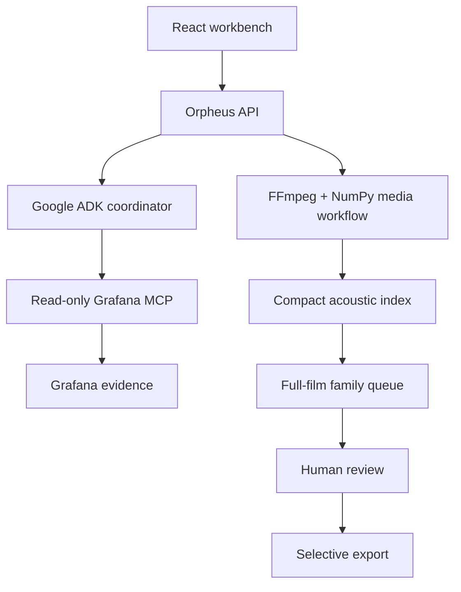

  

# Orpheus

## Picture first. Sound considered. Evidence retained.

Orpheus is an agentic Foley workbench for a problem that usually becomes repetitive, risky manual work: finding a recurring sound event across a film and replacing only the occurrences that actually deserve a new performance.

A creator marks one confirmed sound inside a short Part. Orpheus searches the complete film locally for acoustically related moments, lets the creator review the family, fits one replacement take inside that bounded Part, and renders only the ranges the creator accepts. Original picture remains intact; unaccepted sound stays original.

  
  

## The problem

A feature-length film may contain hundreds of acoustically similar footsteps, clothing rustles, taps, and prop contacts. A Foley performer needs a way to locate related moments and lay in a better take without turning a useful assist into an unsafe whole-soundtrack rewrite.

Existing AI demos often stop at a generated clip or a persuasive chat response. That does not solve the editor's real work: choosing the correct source moment, preserving the picture clock, comparing exact alternatives, diagnosing a bad render, and deciding which occurrence should change.

Orpheus treats the sound family as a reviewable object. The system can rank related events and coordinate a fitting pass, but the creator controls family membership, the replacement take, and every durable approval.

## What we built

| Orpheus capability | What it does | Why it matters |
| --- | --- | --- |
| **Part-first inspection** | Opens a stable 5–60 second picture window with exact source time, audible-track switching, and a bounded waveform. | The creator works on a real moment, not a vague full-movie abstraction. |
| **Query-by-example families** | Uses a confirmed seed and optional accepted/rejected examples to rank acoustically related moments across the same film. | One known event becomes a searchable, reviewable family without claiming semantic recognition. |
| **Family-scoped replacement takes** | Records or uploads one immutable take per family and creates a deterministic preview. | The replacement remains tied to the sound it is meant to solve. |
| **Agent-coordinated fitting** | Uses a bounded ADK run to improve crop, timing, and gain inside an explicitly authorized Part. | The agent helps with a hard local fit without receiving or rendering the entire film. |
| **Exact-candidate review** | Keeps original and replacement on the same picture clock, then records an approval or rejection against the artifact hash. | Approval cannot leak from one revision to another. |
| **Long-film local search** | Builds a compact, resumable acoustic index and reviews full-film candidates in batches. | The costly model step stays short; scalable search remains deterministic and local. |
| **Selective render** | Ducks and overlays only accepted arrangement rows; reuses the original video stream. | Pending, rejected, unclassified, and untouched audio remains unchanged. |
| **Grafana evidence plane** | Correlates agent, render, timing, loudness, clipping, provider, and human-review evidence through scoped read-only MCP calls. | The agent and reviewer can judge the same evidence before a candidate is selected. |

## Product walkthrough

  

| 1. Agent-coordinated fitting | 2. Exact review | 3. Evidence control room |
| --- | --- | --- |
|  |  |  |
| A confirmed Part and take define the agent boundary. | A creator compares exact audio against the same picture time. | The dashboard makes prior runs, measurements, and decisions inspectable. |

## How the agent works

The agent does not replace the deterministic matcher. Each handles a different job.

1. The creator imports a film and opens a representative **Part**.
2. The creator marks a sound event and assigns a recorded or uploaded replacement take.
3. Orpheus creates a deterministic baseline candidate inside the Part.
4. If the creator explicitly authorizes it, the ADK coordinator queries scoped Grafana MCP evidence, proposes bounded crop/timing/gain changes, and measures the candidate.
5. The creator auditions the exact candidate and approves or rejects it.
6. Only an approved Part becomes the template for deterministic matching over the **Full Movie**.
7. The creator reviews the ranked queue and selects accepted occurrences.
8. Orpheus renders those accepted rows and preserves all other source audio.

| Agent can | Agent cannot |
| --- | --- |
| Read the selected Part, take profile, baseline result, scoped operational history, and measured candidate evidence. | Treat a detector hit or similarity score as an approved family member. |
| Propose crop, timing, and gain inside the confirmed Part. | Read or render the full movie as one paid job. |
| Diagnose evidence and runtime failures through read-only Grafana MCP. | Write to Grafana, approve a candidate, or hide an unavailable evidence source. |
| Hand a human-approved example to local full-film matching. | Replace audio outside the final accepted arrangement rows. |

## Why Grafana MCP is essential

Grafana is not a decorative dashboard in Orpheus. It is the evidence contract between agent, renderer, and reviewer.

Before agent fitting, the coordinator must retrieve scoped run/take/failure history through the read-only Grafana MCP adapter. After rendering, it must retrieve evidence tied to the exact candidate: clipping, timing, loudness, export state, and human verdict. An empty or failed query is not a green light. It blocks paid fitting while preserving all non-agent editing work.

| Evidence | What it prevents |
| --- | --- |
| Prior takes, failures, and experiment history | Repeating a known-bad fitting plan. |
| Timing, loudness, true-peak, and clipping measurements | Choosing a render merely because it was produced. |
| Candidate and review correlation | Transferring approval from an old candidate to a revision. |
| Collector, MCP, export, and provider health | Presenting degraded infrastructure as a successful run. |

Raw film media, prompts, credentials, and raw provider responses are excluded from telemetry.

## How we built it

| Technology | Role in Orpheus |
| --- | --- |
| React 19 + Vite | Cinematic landing page and picture-led Foley workspace. |
| Python 3.11 + FFmpeg/FFprobe | Streamed import, preparation, waveform/reel generation, selective audio render, and picture preservation checks. |
| NumPy | Compact memory-mapped acoustic fingerprints and deterministic cosine ranking. |
| Google ADK / Agent Engine | Bounded agent coordination and managed hosted sessions for authorized fitting. |
| Vertex/Gemini and configured provider adapters | Explicit model execution within the Part contract; provider state and failures remain receipted. |
| Grafana, Loki, Tempo, Prometheus, and Grafana MCP | Redacted evidence collection, dashboards, correlations, alerts, and read-only agent evidence queries. |
| Firebase Hosting + Cloud Run + Cloud Storage + Cloud SQL | Hosted browser delivery, API/job execution, media artifacts, and product metadata. |

## What makes Orpheus different

- **It starts with one trusted example.** The system does not pretend to recognize every action in every film; it learns a local acoustic family from confirmed evidence.
- **It keeps paid AI narrow.** The model works on a short Part. The full-film search is local, compact, resumable, and reviewable.
- **It makes the agent accountable to evidence.** Grafana MCP history is required before a paid fit; exact candidate evidence is required before selection.
- **It preserves editorial control.** A match is a proposal, a rendered candidate is an alternative, and approval remains human.
- **It preserves the material.** The original upload and video stream remain intact; only accepted audio windows are altered.

## Honest limits

- Similarity is acoustic ranking evidence, not a probability and not semantic recognition. New surface, shoe, pace, mix, or background conditions can lower recall or create false matches.
- Full-film matching works best after a representative Part and a human-approved example. It does not promise to find silent or radically different source events.
- The current product is single-user. Collaboration, shared libraries, neural source separation, and automatic approval are out of scope.
- Test fixtures prove workflow, indexing, review, and render preservation. They do not prove universal artistic quality or rights to third-party media.
- The final public demo video URL should be added before submission. The live workspace and source repository are available now.

## Try it

- **Live workspace:** [orpheus-agentic.web.app](https://orpheus-agentic.web.app/)
- **Workspace route:** [orpheus-agentic.web.app/workspace](https://orpheus-agentic.web.app/workspace)
- **Source:** [github.com/azharizz/Orpheus](https://github.com/azharizz/Orpheus)
- **Product contract:** [PRODUCT.md](../PRODUCT.md)
- **Benchmark:** [SIMILARITY_BENCHMARK.md](SIMILARITY_BENCHMARK.md)
- **Verified status:** [STATUS.md](STATUS.md)

## What we learned

The useful role for an agent in Foley is not “replace everything that sounds similar.” It is coordinating a bounded creative decision: inspect the evidence, fit a real take to one real moment, measure the result, and leave the final editorial decision visible and reversible.

A full-film workflow needs two kinds of intelligence. The agent helps understand and fit a representative Part. The deterministic index makes the resulting family practical at film scale. Neither should silently overrule the creator.
